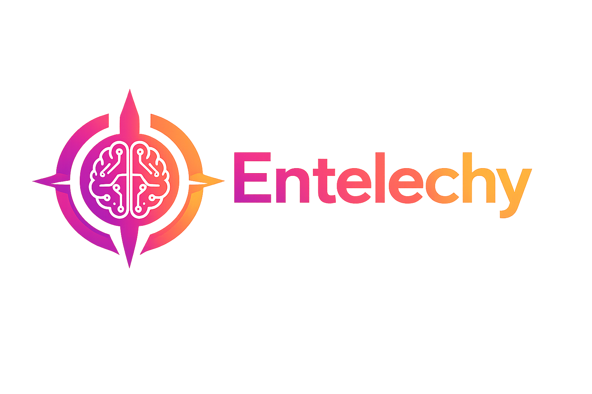

<div align="center">


**Closed-Loop State-Conditioned Generative Control System**

[Documentation](https://mindmods.org) • [Paper](https://arxiv.org/abs/2512.12818) • [Cookbook](https://mindmods.org/cookbook)

[](https://github.com/garybense/entelechy/actions/workflows/release.yml)
[](https://opensource.org/licenses/MIT)
<br/>

</div>

---

## What is Entelechy?

**Entelechy is a Memory-Weighted Policy Modulation Controller (MWPMC).**

Most agent memory systems treat memory as a static "history" database that an LLM must actively choose to query. Entelechy inverts this paradigm. It acts as an **invisible orchestrating middleware**, treating the LLM not as an autonomous actor, but as a stateless functional unit that must be *conditioned* at every execution step.

Memory is not persisted as runtime state; rather, identity and policy are **re-derived at every interaction** from a weighted episodic memory graph (the *State Reconstruction Loop*) and used to modulate the LLM's inference-time controls.

## The Zero-Intervention Architecture

Entelechy removes the burden of "tool use" from the LLM. It guarantees compliance and continuity through the **SVT Continuation Protocol (SVT-CP)**, entirely mediated by your application backend (the Orchestrator).

### The SVT-CP Loop:
1. **Feature Extraction (Pre-Flight):** Before the LLM generates a single token, the Orchestrator calls Entelechy's `/bootstrap` endpoint. Entelechy parses the user's prompt against their memory graph to compute a dense **State Vector**.
2. **Policy Synthesis:** Entelechy synthesizes the **Policy Vector (Vector P)**, calculating required reasoning depth, verbosity, and disposition (Skepticism, Literalism, Empathy) based on historical context.
3. **Policy Control (Injection):** The Orchestrator invisibly injects this synthesized policy directly into the LLM's System Prompt. The LLM boots up completely aligned with the user's history.
4. **Outcome Writeback:** When the LLM finishes streaming its response to the user, the Orchestrator intercepts the payload and fires a background `/retain_async` webhook to Entelechy, logging the interaction as an `[EXPERIENCE]` fact. The memory graph evolves without the LLM ever making a tool call.

---

## Frictionless Onboarding: Implicit 1-to-1 Mapping

Users should not have to manually configure "Brains" or manage memory infrastructure. Entelechy is designed to be deeply integrated with modern Auth providers (like Clerk, NextAuth, or Supabase).

When a user signs up to your application, your auth webhook simply calls:
```http
POST /v1/default/banks/{user_id}
```
Entelechy's `create_bank` operation is an idempotent get-or-create. The user's isolated memory graph is provisioned instantly and invisibly.

---

## The Control Plane

Entelechy ships with a Next.js **Control Plane** featuring a modern, cybernetic Coral-to-Amber GUI. 

The Control Plane visualizes the SVT-CP execution pipeline and includes a built-in **Zero-Intervention Chat Simulator**. You can use the simulator to test your Orchestrator routing, observe the invisible `/bootstrap` injections, and watch background `/retain_async` operations evolve the graph in real-time.



---

## Quick Start (Docker)

To launch the full Entelechy stack (PostgreSQL pgvector, Python API Engine, and Next.js Control Plane):

```bash
export ENTELECHY_API_LLM_PROVIDER=vertexai  # Or openai, anthropic, etc.
# Note: For Vertex AI, ensure your service-account-key.json is mounted or ADC is configured.

docker run --rm -it --pull always -p 8888:8888 -p 3005:3005 \
  -v $HOME/.entelechy-docker:/home/entelechy/.pg0 \
  ghcr.io/garybense/entelechy:latest
```

> **Dataplane API:** `http://localhost:8888`  
> **Control Plane UI:** `http://localhost:3005/banks/newdev?view=chat-simulator`

---

## Documentation & Developer Tools

> 🤖 **Using a coding agent?** Install the Entelechy documentation skill for instant access to the MWPMC architectural guidelines while you code:
> ```bash
> npx skills add https://github.com/garybense/entelechy --skill entelechy-docs
> ```
> Works with Claude Code, Cursor, Gemini, and other AI coding assistants.

### Core Endpoints for Orchestrators
*   `POST /v1/default/banks/{bank_id}/sessions/bootstrap` - Pre-flight State Vector extraction.
*   `POST /v1/default/memories/retain_async` - Fire-and-forget background interception.
*   `GET /mcp/{bank_id}/` - Single-bank scoped MCP access for legacy agents.

## License
MIT
